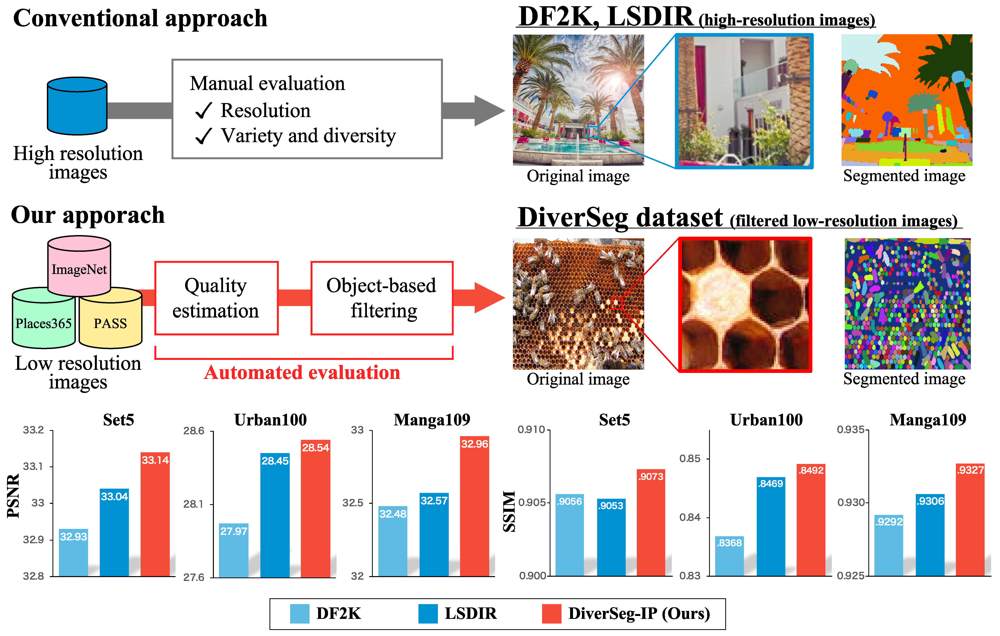

# DiverSeg dataset (ECCV2024)
This repository provides instructions for downloading datasets and scripts for creating DiverSeg dataset.

Details are described in the following paper:

"Rethinking Image Super-Resolution from Training Data Perspectives",      
Go Ohtani, Ryu Tadokoro, Ryosuke Yamada, Yuki M. Asano, Iro Laina, Christian Rupprecht, Nakamasa Inoue, Rio Yokota, Hirokatsu Kataoka, and Yoshimitsu Aoki, In ECCV2024.

<div style="text-align: center;">

</div>

# Download datasets

## ImageNet (ILSVRC2012)
This dataset can be downloaded from [the official website](https://image-net.org/challenges/LSVRC/2012/2012-downloads.php)).
## PASS
You can download this dataset using [this code](https://gist.github.com/yukimasano/421204a5a74a5c150537366a767a1a04).

# Create DiverSeg dataset
Please make sure that the structure of each downloaded dataset is as follows:
```sh
#ImageNet
/path/to/imagenet/
    n01440764/
        n01440764_18.JPEG
        n01440764_36.JPEG
        ...
        ...
    n01443537/
        ...
        ...   
    ...

#PASS
/path/to/pass/
    0/
        0a0bf4db55141fcfff5da2c8655f93.jpg
        0a0c781911dcb7ba44737c02e3b961f.jpg
        ...
        ...
    1/
        ...
        ...   
    ...
```
Run the following scripts to create DiverSeg-I, DiverSeg-P, and DiverSeg-IP datasets.
```sh
#DiverSeg-I
source make_DiverSeg.sh /path/to/imagenet /path/to/DiverSeg-I DiverSeg-I_list.txt

#DiverSeg-P
source make_DiverSeg.sh /path/to/pass /path/to/DiverSeg-P DiverSeg-P_list.txt

#DiverSeg-IP
source make_DiverSeg.sh /path/to/imagenet /path/to/DiverSeg-IP DiverSeg-I_list.txt
source make_DiverSeg.sh /path/to/pass /path/to/DiverSeg-IP DiverSeg-P_list.txt
```

